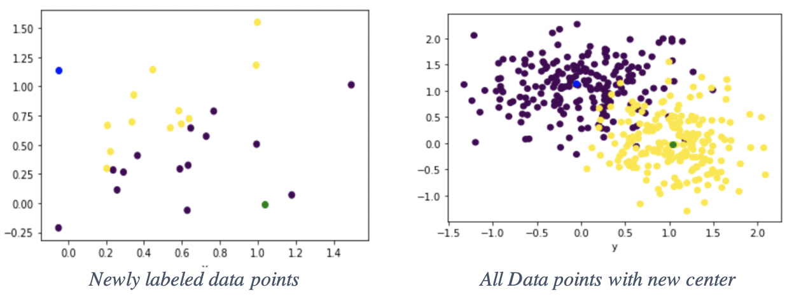
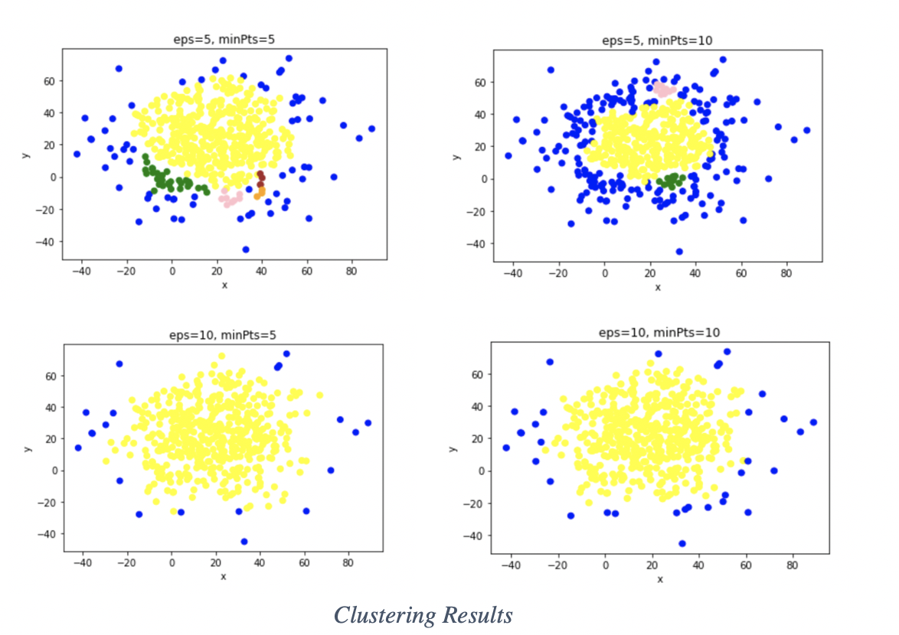

# FuzzyClustering_DBSCAN

# Task 1 : Fuzzy Clustering using EM 

### Data Description
The dataset contains 400 2D points totally with 2 clusters. Each point is in the format of [X- coordinate, Y-coordinate, label].

### Implementation
 Manually implement Fuzzy Clustering using the EM algorithm

Initial Setting

* The centers of each cluster referred c0 and c1 to label 0 and label1 respectively.  
The initial settings are  c0=( -0.428721, 1.555075), label = 0 and c1=( 0.749460,0.343558 0) , label = 1

Fuzzy clustering with EM algorithm 

* Fuzzy clustering with EM algorithm implemented in two steps in the program which are E_step and M_step. 
* E_step returns the weights for each data point, while M_step returns a new center of cluster based on weights, which is the result of E_step. 
* When two steps are completed, the updated center is available so that the Sum of Square Error(SSE) can be calculated. 
* The last step is finding the new centers that maximize the SSE. Table1 is the results of two steps iteratively until SSE converges.

### Result
Reassigning the clusters to all data points is proceeded, which is decided by comparing the distances to both c0 and c1.

# Task 2 : 2.	DBSCAN
DBSCAN algorithm to cluster the dataset and find outliers

### Data Description
the dataset DBSCAN.mat with 500 2D points

### Implementation
 Parameter Setting
1. Set ε = 5, Minpoints=5.
2. Set ε = 5, Minpoints=10
3. Set ε = 10, Minpoints=5.
4. Set ε = 10, Minpoints=10.

### Result

the results for clustering is shown in the Table 

| (eps,minPts)| num_cluster | num_outliers |
| --- | --- |----|
|(5,5) | 5 | 65|
| (5,10)  | 3 | 194|
| (10,5)  | 1 | 20|
| (10,10) | 1 | 33|

The smaller eps make more clusters. When eps is big, there is only one cluster in the dataset. 
It is noticeable that when minPts = 10 in both the second trial and the fourth trial, the difference between the number of outliers are obvious. This is because big min points tend to give more outlier in the borders.  
However, the fourth trial has only one cluster, which means the border only exist to cluster itself. This results in a smaller number of outliers than the second trial.

